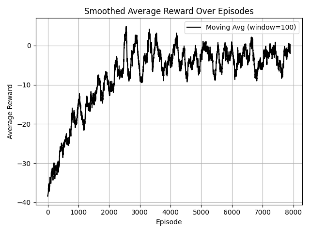
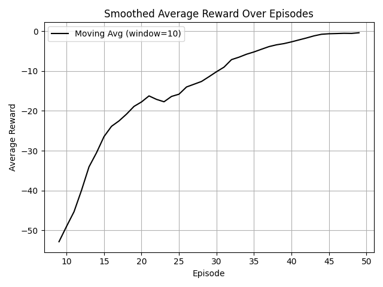
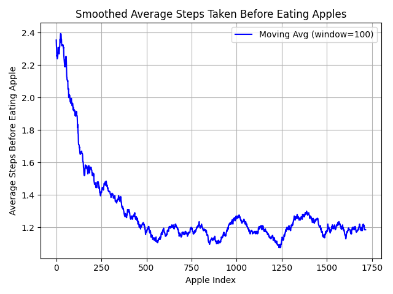

# Darwin's Playground

**Avtorji:** David Jerman, Andraž Škof.

## Ključne besede

1. Večagentni sistemi,
2. Simulacija prilagajanja,
3. Q-Learning,
4. Učenje s krepitvijo,
5. CTDE.

## Povzetek

Projekt razvija večagentni sistem, osredotočen na žrtve (rastlinojedce) in njune preživetvene strategije v dinamičnem
okolju, kjer morata iskati hrano in vodo ter se prilagajati različnim tipom terena, ki se skozi čas spreminjajo.

Jedro najine rešitve temelji na Q-učenju, nadgrajenem s pristopom CTDE (Centralized Training with Decentralized
Execution), ki agentom omogoča med učno fazo izmenjavo informacij in znanja, medtem ko v realnem času delujejo
neodvisno. S tem izboljšava koordinacijo in učinkovitost posameznih agentov in populacije kot celote.

Okolje je predstavljeno kot dvodimenzionalna mreža z različnimi tipi površin in viri, ki se skozi čas spreminjajo.
Agenti pridobivajo informacije z opazovanjem okolja in na podlagi tega sprejemajo odločitve.

Implementacija temelji na knjižnici RLLib in programskem jeziku Python. Za primerjavo učinkovitosti najinega Q-učenja
s CTDE, sva uporabila algoritem PPO iz RLLib, ki je široko uporabljen in učinkovit pristop v večagentnem učenju.

## Uvod

Večagentsko ojačitveno učenje (Multi-Agent Reinforcement Learning, MARL) predstavlja pomembno področje umetne
inteligence, kjer se več agentov sočasno uči in prilagaja svoja dejanja v dinamičnem okolju. V nasprotju z osnovnimi
metodami ojačitvenega učenja, ki se osredotočajo na enega samega agenta, MARL naslavlja izzive sodelovanja, koordinacije
in usklajevanja med agenti za dosego skupnega ali individualnega cilja.

Glavna prednost teh metod v primerjavi z osnovnimi pristopi je kooperacija različnih agentov za dosego cilja. Agenti
lahko na podlagi lokalnega znanja in izmenjave informacij pridejo do konsenza in sprejemajo boljše odločitve, ki vodijo
v uspešnejše raziskovanje okolja.

V večagentskem ojačitvenem učenju je ključen izziv prilagajanje dejanj posameznega agenta dinamičnemu okolju ter
izboljšanje celotne učinkovitosti sistema. Večina algoritmov predpostavlja, da agent pozna strukturo igre ali Nashovo
ravnotežje ter da ima informacije o dejanjih in nagradah drugih agentov. Ker nagrade temeljijo tako na lastnih kot na
dejanjih sodelujočih agentov, lahko MDP model ojačitvenega učenja obravnavava kot večagentsko Markovljevo igro [5].

Pri učenju agenti uporabljajo strategije raziskovanja, kot sta ε-greedy in Boltzmannova eksploracija, saj na začetku
nimajo zadostnega znanja o okolju. Zaradi omejenih izkušenj pogosto večkrat obiščejo ista stanja, kar postane
problematično v večjih prostorskih stanjih. Ključen izziv pri sodelovalnih večagentskih sistemih je omogočanje izmenjave
znanja med agenti [5].

Prva izmed metod večagentnega učenja s krepitvijo je CTDE.
Metoda CTDE (Centralised Training, Decentralised Execution) je splošna metoda, kjer učenje agentov poteka 
centralno – delitev znanja. Agenti pa akcije izvedejo neodvisno drug od drugega na podlagi svojih preteklih 
izkušenj. Agenti lahko v fazi učenja uporabijo informacije, ki jim med decentraliziranim izvajanjem niso bile 
na voljo.

Nekateri tovrstni pristopi uporabljajo deljeno Q-funkcijo v času učenja. Izguba (loss) se tako za vsakega 
agenta v času učenja izračuna kot skupna Q-funkcija. Posledično imajo agenti tudi tekom decentraliziranega 
izvajanja nekaj znanja od ostalih agentov [4].

DQN (Deep Q-network) je nadgradnja Q-učenja, ki za funkcijo aproksimacije uporablja nevronsko mrežo. Vendar
pa ima DQN informacije o celotnem okolju, zato ta metoda ni relevantna za najin problem.

DRQN (Deep Recurrent Q-network) pa reši problem pomanjkljivih podatkov o okolju, saj omogoča delo z delnimi 
podatki. DRQN temelji na RNN modelu, katerega namen je, da hrani zgodovino vhodnih vrednosti in jo ponovno 
uporabi v prihodnjih napovedih [4].

QMIX je metoda za večagentsko ojačitveno učenje, ki razširja VDN (Value Decomposition Networks) tako, da
omogoča bolj splošne razgradnje vrednostnih funkcij. Namesto preproste vsote lokalnih Q-funkcij, QMIX modelira
skupno Q-funkcijo kot monotono nelinearno funkcijo posameznih Q-funkcij agentov. To pomeni, da lahko agenti še
vedno izbirajo akcije na podlagi svojih lokalnih Q-vrednosti, kar omogoča učinkovitejše usposabljanje in
decentralizirano izvajanje.

QMIX uporablja mixing network, ki zagotavlja monotono kombinacijo posameznih Q-funkcij s pomočjo hiperomrežij,
ki generirajo uteži. Med učenjem se omrežje trenira end-to-end, pri čemer se optimizira napaka med napovedano
skupno Q-funkcijo in ciljno vrednostjo, ki temelji na diskontiranih prihodnjih nagradah. Metoda se dobro 
obnese v okoljih, kjer agenti lahko delujejo pretežno neodvisno, vendar ima omejitve pri nalogah, kjer je 
nujno usklajevanje med agenti [4].

Metoda HC-MARL uporablja več slojev konsenza: konsenz na dolgi rok in konsenz na kratki rok. Kratka opazovanja
v okolju sprožijo takojšen, nizko-nivojski konsenz, medtem ko daljša opazovanja okolja sprožijo bolj 
strateški, visoko nivojski konsenz. Algoritem pa uporablja tudi mehanizem za prilagajanje pomembnosti vsakega 
nivoja, ki se spreminja skupaj z dinamičnim okoljem. Na ta način agenti bolj strateško sprejemajo odločitve, 
ki prinašajo takojšnjo nagrado in odločitve, ki nagrado prinašajo na dolgi rok. HC-MARL je posebej zanimiv za 
najin primer, saj omogoča agentom, da kombinirajo kratkoročne in dolgoročne strategije preživetja v 
dinamičnem okolju [3].

## Sorodna dela

Večina raziskav na področju večagentskega učenja s krepitvijo uporablja klasične algoritme, kot je Proximal Policy
Optimization (PPO), kot osnovo za primerjave in razvoj novih metod. PPO je učinkovit in stabilen algoritem za učenje
posameznega agenta v dinamičnih okoljih. Čeprav ga je mogoče uporabiti tudi v večagentskih okoljih, osnovna zasnova
PPO ni posebej prilagojena za kooperacijo ali izmenjavo informacij med agenti [8].

Zaradi narave večagentnih problemov, kjer mora vsak agent prilagajati svoje odločitve na podlagi vedenja drugih agentov,
postanejo enostavni algoritmi, kot je PPO, manj učinkoviti pri usklajevanju in sodelovanju med agenti. Zato so bile
razvite metode, kot sta HC-MARL in CTDE, ki omogočata boljšo koordinacijo in delitev informacij med agenti, kar vodi
do uspešnejšega reševanja skupnih ciljev v kompleksnih okoljih. Eno izmed del, ki sva ga vzela za zgled, je delo [3].

V najinem delu uporabljava PPO kot osnovni primer primerjave, da izpostaviva prednosti večagentskih pristopov, predvsem
na področju sodelovanja in konsenza med agenti.

## Metodologija

V najinem projektu sva osredotočila na razvoj inteligentnih agentov (živali), ki se v simuliranem
okolju učijo učinkovito iskati vire hrane in vode. Okolje je predstavljeno kot mreža točk, kjer
so razporejeni ti viri, agenti pa se lahko med njimi premikajo.

Okolje, v katerem delujejo agenti, je dvodimenzionalna mreža ploščic. Vsaka
ploščica lahko predstavlja različen tip terena: travnik, pesek, gore, vodo, hrano itd. Gibanje agenta
je na določenih ploščicah omejeno. Agent se mora takim ploščicam izogibati.

Stanje agenta je predstavljeno z več lastnostmi, kot so življenje, pozicija, lakota itd. Agent se tako
na podlagi svojega stanja in stanja okolja odloči za naslednjo akcijo: gibanje v prostoru v vse štiri
smeri, prehranjevanje, lahko pa tudi ne stori nič.

Agent za svoje akcije prejme nagrado ali pa kazen. Nagrado prejme vedno kadar najde hrano ali vir vode,
kaznovan pa je takrat, ko izgubi energijo zaradi neuspešnega iskanja. Pri tem je treba poudariti, da je
kazen dosti manjša od same nagrade, saj bi sicer bila izguba prevelika.

Za učenje uporabljava pristop Q-učenje, ki agentom omogoča, da na podlagi nagrad in kazni postopoma
izboljšujejo svojo politiko odločanja. Ključno pri tem je, da agenti poskušajo uravnotežiti
raziskovanje neznanih poti in izkoriščanje že naučenih strategij.

Ker pa v najinem sistemu deluje več agentov, je pomembno, da lahko medsebojno izmenjujejo informacije,
kar poveča učinkovitost učenja. Zato uporabljava paradigmo Centralized Training with Decentralized
Execution (CTDE). To pomeni, da med treningom agenti centralno delijo svoja znanja in izkušnje, kar
pospeši učenje skupne politike, medtem ko v fazi izvajanja vsak agent deluje samostojno z lokalnimi
informacijami.

Pri implementaciji učenja in simulacije agentov uporabljava knjižnico RLLib, ki je del orodij za
večagentno učenje in ponuja podporo za različne algoritme, kot je Proximal Policy Optimization (PPO).
PPO bova uporabili kot primerjalni algoritem za oceno učinkovitosti najinega Q-učenja s CTDE
pristopom.

Agenti komunicirajo z izmenjavo ključnih informacij o Q-vrednostih ali optimiziranih poteh, kar
omogoča hitrejše prilagajanje okolju in večjo robustnost sistema.

Za oceno uspešnosti sva uporabila več metrik: povprečna nagrada skozi čas, število korakov do najdbe hrane ter
količino zaužite hrane.

## Poskusi in rezultati

Vzpostavila sva osnovno simulacijsko okolje, kjer agenti izvajajo premike in zbirajo vire, kot sta hrana in voda. Za
učenje in inferenco sva uporabila algoritem PPO iz knjižnice RLlib, ki omogoča učinkovito implementacijo in testiranje
modelov za večagentno učenje.

Z uporabo PPO sva izvedla začetne poskuse, ki so služili predvsem preverjanju funkcionalnosti okolja in pravilnosti
interakcij agentov z okoljem. Ti poskusi so potrdili, da okolje deluje skladno z zastavljenimi pravili ter da agenti
uspešno sprejemajo odločitve na podlagi prejetih nagrad.

Najino Q-učenje s CTDE se je naučilo hitreje, kar kaže na učinkovito začetno prilagajanje agentov, vendar so bile
nagrade precej bolj nihajoče in manj stabilne v primerjavi z algoritmom PPO, ki sicer uči počasneje, a doseže bolj
stabilno in nekoliko višjo končno nagrado. To nakazuje, da ima najin pristop prednosti v hitrosti učenja, medtem ko
PPO bolje zagotavlja stabilnost in zanesljivost.

Povprečna nagrada skozi čas za najin algoritem:

Povprečna nagrada skozi čas za algoritem PPO:

Razlika v stabilnosti nagrad med CTDE in PPO izhaja predvsem iz različnih principov učenja. PPO je politika-gradientni
algoritem, ki optimizira politiko z zmernimi posodobitvami, kar preprečuje prevelike skoke v vrednostih in zagotavlja
stabilnejše učenje. Najino Q-učenje s CTDE pa temelji na vrednostnem učenju z izmenjavo informacij med agenti, kar
lahko vodi do hitrejšega prilagajanja, a tudi večjih nihanj, saj so posodobitve bolj odvisne od trenutnih izkušenj in
komunikacije, ki še ni popolnoma implementirana ali optimizirana.

Grafi, ki prikazujejo število korakov do najdene hrane in količino zaužite hrane, so na voljo samo za najino Q-učenje s
CTDE, saj nisva posegla v notranje delovanje PPO in nisva zabeležila teh metrik zanj. Iz spodnjega grafa je razvidno, da
je najin algoritem predvsem optimiziral število korakov, ki jih agent potrebuje, da doseže hrano.

Število korakov pred odkrito hrano:

## Zaključek

Projekt je pokazal, da je večagentno učenje v simuliranem okolju izvedljivo, čeprav z določenimi omejitvami. 
Vzpostavljena je stabilna osnova, kjer agenti zbirajo vire in se učijo z uporabo PPO algoritma iz knjižnice RLlib ter
najinega Q-učenja s CTDE. Rezultati kažejo, da Q-učenje s CTDE omogoča hitrejše prilagajanje, a z bolj nihajočimi in
manj stabilnimi nagradami v primerjavi s PPO, ki je počasnejši, a zanesljivejši.

Za prihodnje delo bi bilo smiselno:
- Nadgraditi okolje z večjo kompleksnostjo in dodatnimi parametri, ki bi vplivali na strategije agentov.
- Izboljšati komunikacijo med agenti z razširjeno izmenjavo informacij, da bi povečali učinkovitost sodelovanja in
  stabilnost učenja.
- Razviti in preizkusiti dodatne večagentne algoritme, ki bi lahko izboljšali tako hitrost učenja kot stabilnost.
- Izvesti poglobljeno evalvacijo različnih pristopov na bolj raznolikih in zahtevnejših scenarijih.

Takšne nadgradnje bi lahko bistveno prispevale k izboljšanju učinkovitosti in robustnosti sistema v večagentnih okoljih.

## Viri

1. [Holland, J. H. (1975). "Adaptation in Natural and Artificial Systems"](http://repo.darmajaya.ac.id/3794/1/Adaptation%20in%20Natural%20and%20Artificial%20Systems_%20An%20Introductory%20Analysis%20with%20Applications%20to%20Biology%2C%20Control%2C%20and%20Artificial%20Intelligence%20%28A%20Bradford%20Book%29%20%28%20PDFDrive%20%29.pdf),
2. [Wooldridge, M. (2002). "An Introduction to MultiAgent Systems"](https://uranos.ch/research/references/Wooldridge_2001/TLTK.pdf),
3. [Hierarchical Consensus-Based Multi-Agent Reinforcement Learning for Multi-Robot Cooperation Tasks](https://arxiv.org/html/2407.08164v2),
4. [An Introduction to Centralized Training for Decentralized Execution in Cooperative Multi-Agent Reinforcement Learning](https://arxiv.org/pdf/2409.03052),
5. [Collaborative multi-agent reinforcement learning based on experience propagation](https://ieeexplore.ieee.org/document/6587341),
6. [A Distributed Q-Learning Algorithm for Multi-Agent Team Coordination](https://ieeexplore.ieee.org/document/1526928),
7. [Ray](https://docs.ray.io/en/latest/rllib/index.html).
8. [Proximal Policy Optimization Algorithms](https://arxiv.org/abs/1707.06347)
9. [Technical Note Q-Learning](https://d1wqtxts1xzle7.cloudfront.net/35466333/watkins92-libre.pdf?1415404402=&response-content-disposition=inline%3B+filename%3DTechnical_Note_Q_Learning.pdf&Expires=1749246889&Signature=ZwLdIPsptoA08mXLLribet5dXVov6vk~fOH7WPBDAAFUgdJ~--R9DHyohropEvf2S6rkBh20jC0xXSZZMp2~YFZYniH~jVj1cqhDkL~P-QZNwFCnFoXfoTS-KdNSCvq4Fn7LAx8eu-5mdYQJQebVMEtHOnF8FwMQr0zPV76vkGqOUIXwFXw1uxAE-iw2GNkf0Bg5j5Gc8MyRhuro52KCqjyLuue4ZqAF513Kh6EplMcFg4OhR0q2BFizSh-vYlroTG9aMlDZwQvUHzndZ-9snAeiSRZaejDi9bfiL7mT1c5GKn862ZJ63hwLfD5L8faebZpjcI4azJ1MSSyFDVb8sw__&Key-Pair-Id=APKAJLOHF5GGSLRBV4ZA)
