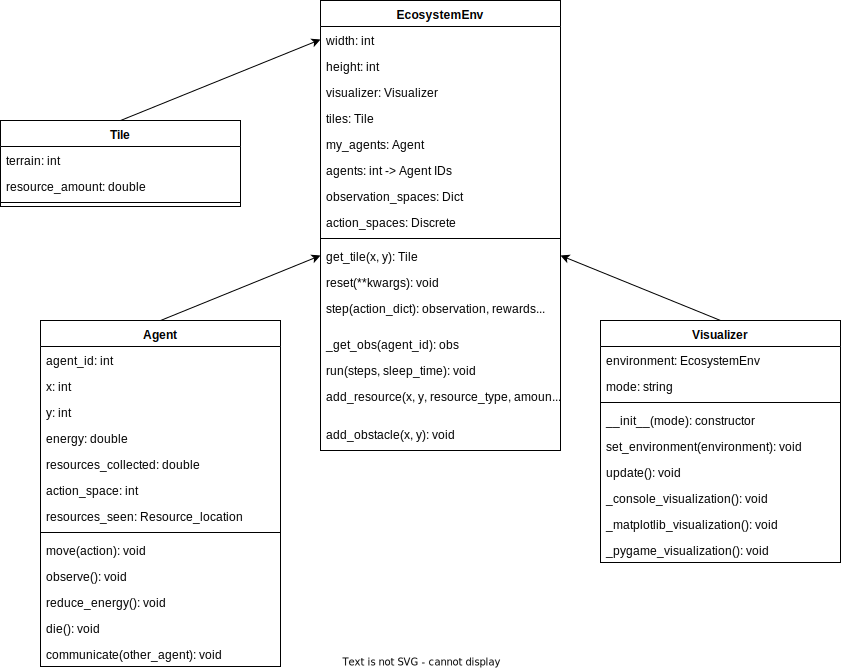

# Darwin's Playground

## Definicija problema

V sistemu bodo dve osnovni vrsti bitij:

- žrtve (rastlinojedci),
- plenilci (mesojedci).

Plenilci potrebujejo tako vodo (morajo najti vodni vir) kot hrano (žrtve), medtem ko žrtve potrebujejo hrano
(vir hrane, kot so rastline) in vodo (vir z vodo). Fokus te raziskovalne naloge bodo žrtve in njihove strategije
za preživetje v danem okolju. Plenilci imajo bolj omejen dostop do virov, kar pomeni, da bodo vedno na preži za
rastlinojedci.

Agenti globalnega znanja o okolju nimajo. Znanje si gradijo na podlagi raziskovanja okolja in informacij, ki
jih dobijo od ostalih agentov.

Strategije agentov bodo zasnovane na podlagi Q-učenja, kjer pa bo poudarek predvsem na izmenjavi informacij
med agenti iste vrste. Izmenjava informacij bo pripomogla k boljšemu uspehu populacije kot celote kot tudi
agenta samega.

### Okolje

Okolje bo predstavljeno s pomočjo dvodimenzionalne plošče, kjer bodo posamezni kvadratki predstavljali
različne dele površja (voda, pesek, viri hrane itd.). Agenti bodo za premikanje po različnih ploščah
porabili različno količino energije. Treba je poudariti tudi, da imajo agenti samo lokalno znanje, tj.
poznajo samo polja, ki so jih že obiskali, ostala pa so jim nevidna.

Okolje je dinamično in se lahko spreminja skozi čas. Lokacija, količina in uporabnost virov (voda, hrana)
se lahko spreminjajo zaradi različnih zunanjih dejavnikov, kot so vremenske spremembe (npr. dež, suša, mrak)
ali sezonske spremembe, ki vplivajo na količino hrane in vode v okolju. Te spremembe bodo vplivale na strategije
preživetja agentov, ki se bodo morali hitro prilagoditi novim pogojem.

### Obnašanje agentov

Agenti bodo lahko v okolju izvedli več različnih akcij:

- gibanje: navzgor, navzdol, levo, desno,
- prehranjevanje: v primeru, da se nahajajo ob viru hrane,
- komunikacija: izmenjava informacij z ostalimi agenti.

Cilj je, da se razvijejo optimizirane strategije za preživetje v tem dinamičnem okolju, ob upoštevanju
spreminjajočih se virov in pogojev.

### Lastnosti agentov

Agenti imajo različne lastnosti, ki vplivajo na njihovo obnašanje in strategijo preživetja:

- energija (potrebna za vse akcije, ko je dosežena energija nič, agent začne izgubljati življenje),
- življenjske točke (ko se agent poškoduje, le-te izgubi, ko je dosežena vrednost nič, agent umre).

Poleg tega vsak agent hrani koristne informacije o okolju, ki jih uporabi kot del strategije za premikanje
po okolju. To so informacije, kot so:

- lokacija virov,
- zadnja videna lokacija plenilcev ...

### Primeri iz realnega sveta

Problemi iz realnega sveta, ki so primerljivi s to nalogo so:

- strateške video igre kot npr. *Sid Meier’s Civilization® VI*, kjer se uporablja kompleksno ravnanje z viri,
  prilagajanje na dinamično okolje in interakcija med različnimi agenti (npr. enotami, naravnimi viri, naselji),
- biološki ekosistemi, kjer se spremljajo interakcije med plenilci in žrtvami, prilagajanje na sezonske spremembe
  in evolucijske strategije za preživetje,
- nadzorovanje naravnih virov v simulacijah, kot so sistemi za upravljanje z vodo, energijo ali gozdovi, kjer
  različni agenti (npr. podjetja, skupnosti, države) sprejemajo odločitve, ki vplivajo na okolje in druge akterje,
- robotika in avtonomni sistemi, kjer roboti sodelujejo in tekmujejo za vire v dinamičnem okolju, kot so pri reševanju
  nalog v nesrečah ali za iskanje virov na težko dostopnih območjih ...

### Ključne besede

1. Večagentni sistemi,
2. Simulacija prilagajanja,
3. Optimizacija strategij,
4. Q-Learning,
5. Učenje s krepitvijo.

## Evaluacija problema

Sledeča dela so bila v pomoč pri načrtovanju evaluacije rešitve:

1. [Holland, J. H. (1975). "Adaptation in Natural and Artificial Systems"](http://repo.darmajaya.ac.id/3794/1/Adaptation%20in%20Natural%20and%20Artificial%20Systems_%20An%20Introductory%20Analysis%20with%20Applications%20to%20Biology%2C%20Control%2C%20and%20Artificial%20Intelligence%20%28A%20Bradford%20Book%29%20%28%20PDFDrive%20%29.pdf),
2. [Wooldridge, M. (2002). "An Introduction to MultiAgent Systems"](https://uranos.ch/research/references/Wooldridge_2001/TLTK.pdf),
3. [Hierarchical Consensus-Based Multi-Agent Reinforcement Learning for Multi-Robot Cooperation Tasks](https://arxiv.org/html/2407.08164v2),
4. [An Introduction to Centralized Training for Decentralized Execution in Cooperative Multi-Agent Reinforcement Learning](https://arxiv.org/pdf/2409.03052),
5. [Collaborative multi-agent reinforcement learning based on experience propagation](https://ieeexplore.ieee.org/document/6587341),
6. [A Distributed Q-Learning Algorithm for Multi-Agent Team Coordination](https://ieeexplore.ieee.org/document/1526928),
7. [Ray](https://docs.ray.io/en/latest/rllib/index.html).

Nekatere izmed metod, ki so bile opisane v člankih so sledeče:

- HC-MARL (Hierarchical Consensus-based Multi-Agent Reinforcement Learning),
- CTDE (Centralized Training Decentralized Execution),

Glavna prednost teh metod v primerjavi z osnovnimi metodami učenja s krepitvijo je kooperacija različnih agentov
za doseg cilja. Agenti lahko na podlagi lokalnega znanja in izmenjave informacij pridejo do konsenza in
sprejemajo boljše odločitve, ki bodo vodile v bolj uspešno raziskovanje okolja.

V večagentskem ojačitvenem učenju je ključen izziv prilagajanje dejanj posameznega agenta dinamičnemu okolju
izboljšanje celotne učinkovitosti sistema. Večina algoritmov predpostavlja, da agent pozna strukturo igre ali
Nashovo ravnotežje ter da ima informacije o dejanjih in nagradah drugih agentov. Ker nagrade temeljijo tako na
lastnih kot na dejanjih sodelujočih agentov, lahko MDP model ojačitvenega učenja obravnavamo kot večagentsko
Markovljevo igro [5].

Pri učenju agenti uporabljajo strategije raziskovanja, kot sta ε-greedy in Boltzmanova eksploracija, saj na
začetku nimajo zadostnega znanja o okolju. Zaradi omejenih izkušenj pogosto večkrat obiščejo ista stanja, kar
postane problematično v večjih prostorskih stanjih. Ključen izziv pri sodelovalnih večagentskih sistemih je
omogočanje izmenjave znanja med agenti. Predlagana optimizacijska metoda cikličnih poti omogoča izvleček
optimalnih poti iz izkušenj, ki jih lahko agenti ali skupine delijo za hitrejšo konvergenco vrednostne funkcije [5].

### Kolaborativno več-agentno učenje s krepitvijo na osnovi propagacije izkušenj

Opisana optimizacijska metoda cikličnih poti omogoča izvleček optimalnih poti iz izkušenj, ki jih lahko agenti
ali skupine delijo za hitrejšo konvergenco vrednostne funkcije [5].

### CTDE

Metoda CTDE je splošna metoda, kjer učenje agentov poteka centralno – delitev znanja. Agenti pa akcije izvedejo
neodvisno drug od drugega na podlagi svojih preteklih izkušenj. Agenti lahko v fazi učenja uporabijo informacije,
ki jim med decentraliziranim izvajanjem niso bile na voljo.

Nekateri tovrstni pristopi uporabljajo deljeno Q-funkcijo v času učenja. Izguba (loss) se tako za vsakega agenta
v času učenja izračuna kot skupna Q-funkcija. Posledično imajo agenti tudi tekom decentraliziranega izvajanja
nekaj znanja od ostalih agentov [4].

### DQN in DRQN

DQN (Deep Q-network) je nadgradnja Q-učenja, ki za funkcijo aproksimacije uporablja nevronsko mrežo. Vendar
pa ima DQN informacije o celotnem okolje, zato ta metoda ni relevantna za najin problem.

DRQN pa reši problem pomanjkljivih podatkov o okolju, saj omogoča delo z delnimi podatki. DRQN temelji na RNN
modelu, katerega namen pa je, da hrani zgodovino vhodnih vrednosti in jo ponovno uporabi v prihodnjih
napovedih [4].

### QMIX

QMIX je metoda za večagentsko ojačitveno učenje, ki razširja VDN (Value Decomposition Networks) tako, da
omogoča bolj splošne razgradnje vrednostnih funkcij. Namesto preproste vsote lokalnih Q-funkcij, QMIX modelira
skupno Q-funkcijo kot monotono nelinearno funkcijo posameznih Q-funkcij agentov. To pomeni, da lahko agenti še
vedno izbirajo akcije na podlagi svojih lokalnih Q-vrednosti, kar omogoča učinkovitejše usposabljanje in
decentralizirano izvajanje.

QMIX uporablja mixing network, ki zagotavlja monotono kombinacijo posameznih Q-funkcij s pomočjo hiperomrežij,
ki generirajo uteži. Med učenjem se omrežje trenira end-to-end, pri čemer se optimizira napaka med napovedano
skupno Q-funkcijo in ciljno vrednostjo, ki temelji na diskontiranih prihodnjih nagradah. Metoda se dobro obnese
v okoljih, kjer agenti lahko delujejo pretežno neodvisno, vendar ima omejitve pri nalogah, kjer je nujno
usklajevanje med agenti [4].

### HC-MARL

Metoda HC-MARL uporablja več slojev konsenza: konsenz na dolgi rok in konsenz na kratki rok. Kratka opazovanja
v okolju sprožijo takojšen, nizko-nivojski konsenz, medtem ko daljša opazovanja okolja sprožijo bolj strateški,
visoko nivojski konsenz. Algoritem pa uporablja tudi mehanizem za prilagajanje pomembnosti vsakega nivoja, ki se
spreminja skupaj z dinamičnim okoljem. Na ta način agenti bolj strateško sprejemajo odločitve, ki prinašajo
takojšnjo nagrado in odločitve, ki nagrado prinašajo na dolgi rok. HC-MARL je posebej zanimiv za najin primer,
saj omogoča agentom, da kombinirajo kratkoročne in dolgoročne strategije preživetja v dinamičnem okolju [3].

## Načrt rešitve

### Informacije o skupini

Izbrana projektna skupina je skupina št. 4.

Na tem projektu pa delava sledeča študenta:

- David Jerman,
- Andraž Škof.

### Tehnične informacije o projektu

Projekt je dostopen na spletni strani GitHub in sicer na sledečem naslovu:
[Darwin's Playground](https://github.com/DavidJerman/Darwins-Playground).

Poglaviten programski jezik izbran za izvedbo tega projekta je `Python`, ki pa se bo kombiniral
z raznimi programskimi knjižnicami, ki bodo omogočile lažji razvoj končne rešitve. Glavna knjižnica
za implementacijo tega projekta bo `Ray` [7].

### Opis rešitve

Najprej, ključno je definirati okolje: kje se nahaja hrana (npr. določene točke s hrano) in voda (morda določena
območja ali točke). Agenti (živali) se bodo gibali po tem okolju, pri čemer bodo s pomočjo Q-learninga poskušali
naučiti optimalne poti do hrane in vode.

Postopek implementacije bi lahko sledil tem korakom:

Stanja (States): Določimo stanja, ki predstavljajo različne lokacije v okolju. Vsako stanje bi lahko predstavljalo
točko na zemljevidu, kjer je mogoče najti hrano ali vodo.

Akcije (Actions): Vsaka žival lahko izvaja določene akcije, kot so premiki na sosednje točke v okolju.

Nagrade (Rewards): Definiramo nagrade, ki jih agent prejme, ko pride do hrane ali vode. Na primer, pozitivna nagrada
za dosego hrane ali vode, negativna za izgubo energije zaradi neuspešnega iskanja.

Q-table: Zgradimo Q-table, ki hrani vrednosti Q(stanje, akcija) za vsako kombinacijo stanja in akcije. Ta tabela se
posodablja glede na izkušnje agentov (živali) v okolju.

Učenje (Learning): Agenti se premikajo po okolju, izvajajo akcije in posodabljajo vrednosti v Q-tabli na podlagi
prejetih nagrad in izbranih akcij.

Raziskovanje in izkoriščanje: Pomembno je najti ravnovesje med raziskovanjem novih poti (različne akcije) in
izkoriščanjem naučenih informacij (npr. optimalne poti do hrane in vode).

Nadgradnja Q-learninga, s tem, da se omogoči komunikacijo med agenti. Agent, ki že pozna del mape lahko ta del ob
komunikaciji opiše drugemu agentu, ki se s tem to nauči. Nadgradnja bi temeljila na pristopu CTDE opisanem
zgoraj.

### Evaluacija rešitve

Uspešnost algoritma ocenjujemo z več ključnimi metrikami, ki merijo, kako dobro se agenti prilagajajo okolju ter
kako hitro in učinkovito se učijo optimalnih strategij preživetja.

1. Hitrost konvergence: Merimo, koliko epizod je potrebno, da agenti dosežejo stabilno strategijo gibanja do hrane in
   vode. Hitrejša konvergenca pomeni bolj učinkovit učni proces.
2. Povprečna pridobljena nagrada: Spremljamo povprečno nagrado agentov skozi iteracije. Višja povprečna nagrada pomeni,
   da agenti bolje optimizirajo svoje poti in zmanjšujejo nepotrebno porabo energije.
3. Delež uspešnih epizod: Izračunamo, kolikšen delež simulacij agenti uspešno zaključijo s pridobitvijo hrane in vode.
   Višji delež uspešnih epizod nakazuje boljše prilagajanje algoritma.
4. Dolžina poti do cilja: Merimo povprečno število korakov, ki jih agent potrebuje za dosego hrane ali vode. Krajše
   poti pomenijo bolj optimalne strategije gibanja.
5. Stopnja deljenja informacij: Ker agenti lahko med seboj delijo znanje, ocenjujemo, kako hitro in učinkovito se novo
   pridobljene informacije prenašajo med agenti in kako to vpliva na učenje celotnega sistema.
6. Robustnost algoritma: Preverjamo, kako dobro agenti prilagajajo svoje strategije v spreminjajočem se okolju, na
   primer ob spreminjanju razpoložljivosti virov ali dodajanju novih agentov.

Na podlagi teh metrik lahko primerjamo različne strategije in ocenimo, ali izboljšave, kot je deljenje informacij med
agenti, dejansko prispevajo k hitrejšemu in boljšemu učenju.

### Iterativen razvoj projekta

#### Iteracija 1: Osnovna struktura

1. Osnovna implementacija agentov in okolja ter njihovih lastnosti na
   podlagi [RLlib’s MultiAgentEnv API](https://docs.ray.io/en/latest/rllib/multi-agent-envs.html#rllib-multi-agent-environments-doc),
2. Osnovna delovanje agentov – gibanje, iskanje virov.

#### Iteracija 2: Povečanje kompleksnosti agentov in okolja

1. Implementacija Q-učenja za agente,
2. Osnovne strategije preživetja.

#### Iteracija 3: Nadgradnja Q-učenja

1. Deljenje znanja med agenti,
2. Kooperativne strategije (nadgradnja Q-učenja).

#### Iteracija 4: Povratne informacije, izboljšave in dokumentacija

1. Optimizacija performance,
2. Končno testiranje,
3. Evaluacija različnih pristopov.

### Poročilo napredka

Delo v posameznih sprintih je razdeljeno glede na člane ekipe.

#### Sprint 1

David Jerman:

- vzpostavitev delovnega okolja (RLlib + torch) in prilagoditev za sisteme z grafično kartico Nvidia,
- vzpostavitev osnovnega okolja na
  podlagi [RLlib’s MultiAgentEnv API](https://docs.ray.io/en/latest/rllib/multi-agent-envs.html#rllib-multi-agent-environments-doc),
- zagon primerov knjižnice RLlib,
- dodan diagram okolja.

Okolje ni bilo v celoti implementirano, saj sem naletel na težave z okoljem RLlib, in sicer je
bilo potrebno dodatno namestiti vse potrebne CUDA/CUD-nn knjižnice ter pravilno verzijo torch, ki
podpira zagon Q-learning-a na grafični kartici. Prav tako je bilo potrebno začetno okolje
prilagoditi, da je kompatibilno s knjižnico RLlib. Nenazadnje pa sem se moral spoznati tudi s
samo knjižnico, katere prej še nisem uporabljal.

#### Sprint 2

David Jerman:

Kaj je bilo narejeno:

- manši popravki,
- analiza primerov PPO (algoritem na osnovi nevronskih mrež za več-agentni sistem - vsebovan v RLLib),
- implementacija osnovnega okolja za PPO,
- učenje, klasifikacija in vizualizacija s PPO za dano okolje.

Kje sem naletel na težave:

Ko sem želel PPO uporabiti v kombinaciji z najinim okoljem, sem naletel na več problemov:

- manjkajoči algoritmi v RLLib - QDN sploh ni prisoten v najnovejši različici,
- težave z delovanjem na Windows sistemu,
- nazadnje sem rešitev prestavil v WSL2, namestil druge verzije knjižnjic in primeri so začeli delovati,
- naletel pa sem tudi na problem, kjer v primeru, da uporabim bolj kompleksna opazovanja pri agentih (
  torej da poleg lokacij opazujem še druge okoljske lastnosti), algoritem ponovno odpove. Za reševanje
  tega problema sem ravno tako zapravil precej časa, a je dokumentacija na spletu slaba, napake, ki pa jih
  dobim pa ne povejo nič uporabnega.

Cilj za naslednji teden:

- usposobiti celotno okolje za PPO,
- nadgraditi okolje,
- začeti z delom na najinem algoritmu (CTDE Q-Learning).

#### Sprint 3

Repozitorij: [Darwin's Playground](https://github.com/DavidJerman/Darwins-Playground)

David Jerman:

Ta teden sem dokončal vse kar sem si zadal za ta šprint:

1. Popravil sem agentovo opazovanje okolja. Zaradi pomanjkljive dokumentacije sem imel kar precej dela.
   Agent zdaj lahko prejme različne podatke, kot so njegova pozicija, pozicija hrane, vrsta terena itd.
   Glavna rešitev je bila uporaba konektorja, ki vhodne podatke zravna (flatten). Dodal sem tudi en sloj po meri.
2. Odstranil sem stare datoteke in obstoječo kodo dokaj enostavno integriral v trenutno ogrodje, saj je bila
   že prej narejena v skladu z RLLib.
3. Izboljšal sem kompatibilnost s strojno in programsko opremo na različnih napravah. Algoritem zdaj uporabi CUDA,
   če je na voljo, sicer pa preklopi na CPU. Uporabnik lahko z zastavico --device izbere želeno napravo.
4. Dodal sem nekaj privzetih vrednosti za lažji zagon.
5. Na koncu sem dodal še možnost uporabe različnih algoritmov (poleg PPO, ki ga uporabljava). Ti algoritmi še niso
   v celoti podprti, saj imajo določene specifike, ki jih bo treba še implementirati.

Andraž Škof:

Ustvarili sem mrežo ploščic (ang. tiles), kjer vsaka ploščica predstavlja določen tip terena. V implementaciji
sem vključil tri osnovne tipe terena:

Trava (🌿)

Pesek (🏜️)

Skale (⛰️)

Postopek generacije:
Inicializacija terena:
Na začetku je celotna mreža zapolnjena z naključno določenim peskom in skalami, nato pa se dodajo gruče trave.

Povezane travnate površine:
Trava ni več razporejena povsem naključno – pazili smo, da se pojavlja v povezanih skupinah po 5–10 ploščic, da
simulira bolj realistično naravno okolje (npr. travnike).

Vizualizacija:
Končni rezultat je bil izpisan v ukazni vrstici, kjer vsak tip terena predstavlja določen emoji, kar omogoča hiter
vizualni pregled nad razporeditvijo terena.
